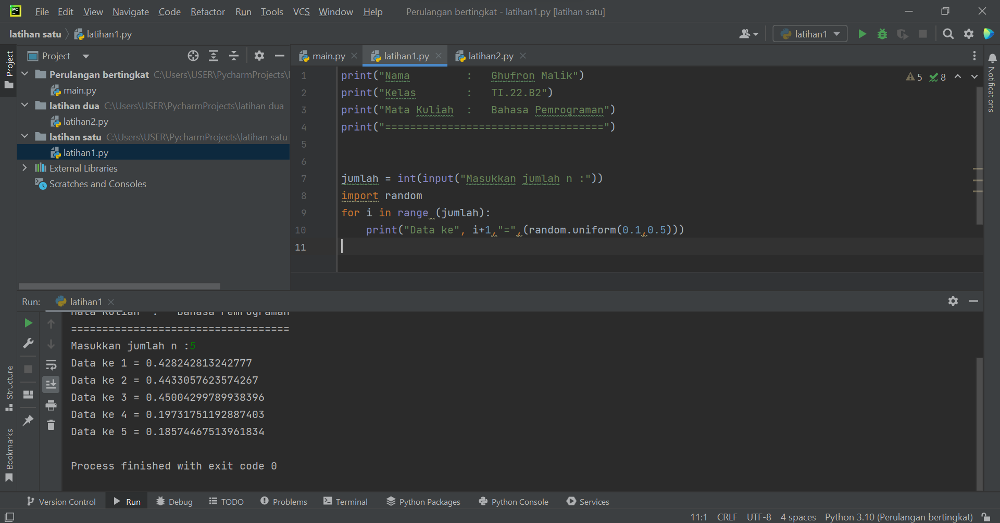

### **Nama         :   Ghufron Malik***
### **Kelas        :   TI.22.B2**
### **Mata Kuliah  :   Bahasa Pemrograman - Pertemuan 7**
### **==========================================**

# Latihan 1

## Soal
1. Tampilkan n bilangan acak yang lebih kecil dari 0.5.
2. nilai n diisi pada saat runtime
3. anda bisa menggunakan kombinasi while dan for untuk menyelesaikannya
4. gunakan fungsi random() yang dapat diimport terlebih dahulu

Setelah menyimak soal di atas kita bisa implementasikan program dengan bahasa Python. Contoh sederhananya seperti ini:

Next. Mari kita terjun lebih dalam lagi.

## A. Penjelasan

