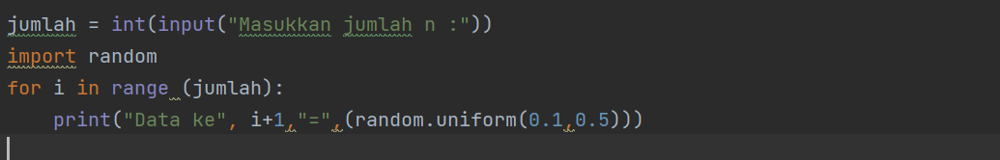
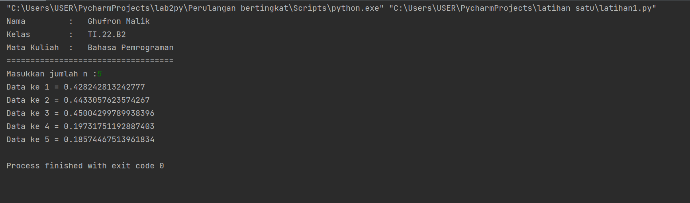
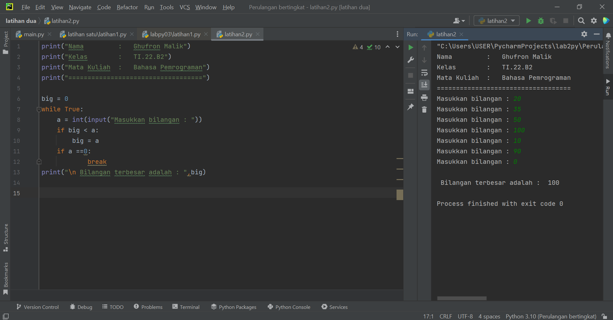
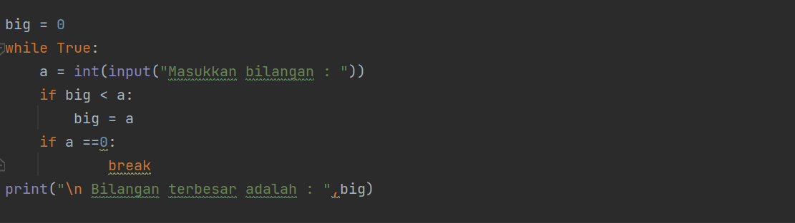
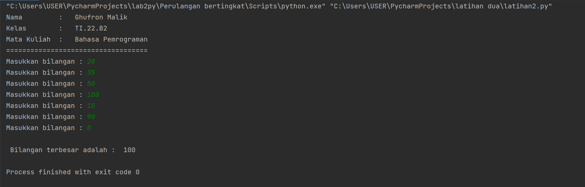
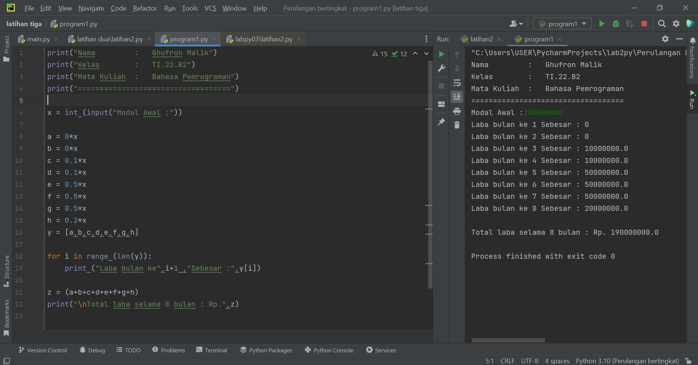
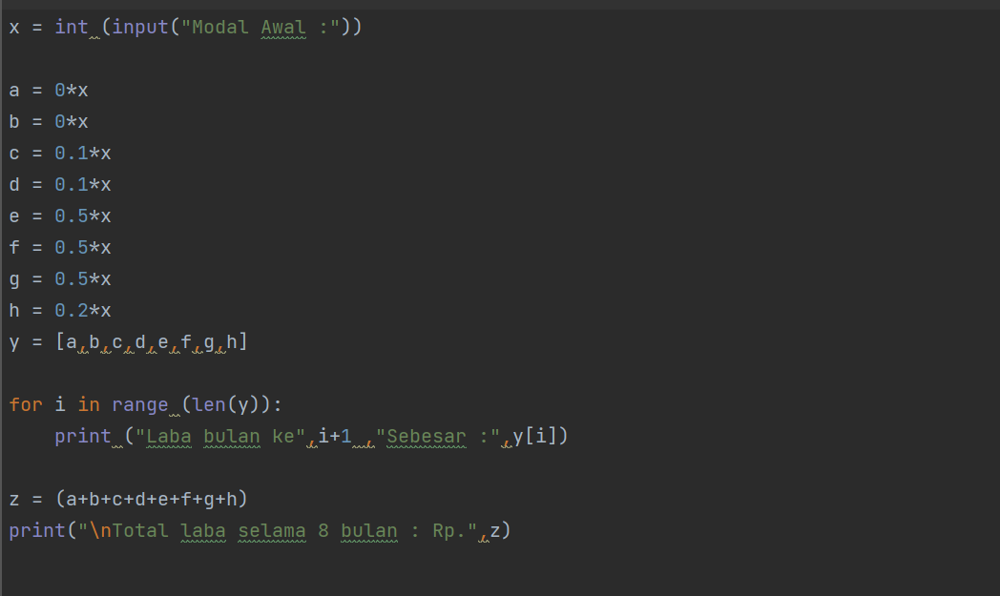
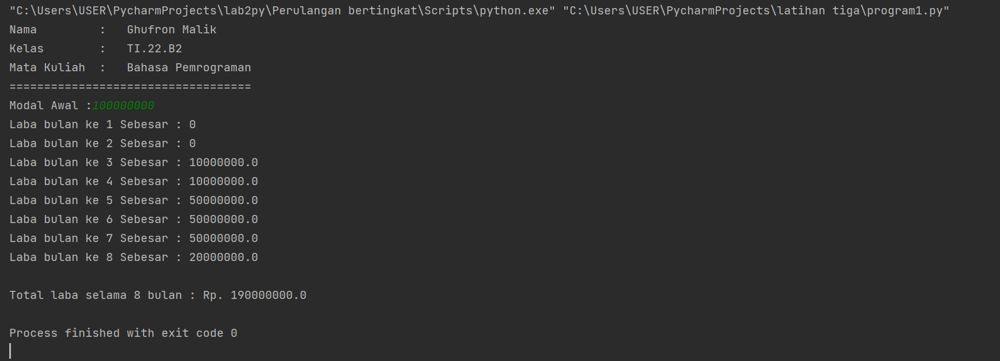

### **Nama         :   Ghufron Malik***
### **Kelas        :   TI.22.B2**
### **Mata Kuliah  :   Bahasa Pemrograman - Pertemuan 7**
### **==========================================**

# Latihan 1

## Menampilkan *n* bilangan acak yang lebih kecil dari 0.5.

Bila di implementasikan dengan bahasa Python.
program dapat digambarkan seperti dibawah ini.

### A. Langkah-langkah
Selanjutnya saya akan mengurutkan langkah-langkah atau algoritmanya.

1. Ketik program *jumlah=int(input("Masukkan jumlah n))*
2. ketik program *import random*
3. Ketik program *for i in range (jumlah):*
4. Ketik program print("Data ke-", 1+i "=" (random.uniform(0.1,0.5)))

Hasil.

5. Masukkan nilai (n) : 5
6. Program akan mencetak data ke 1 sampai 5 dengan nilai kurang dari 0.5

### B. Penjelasan
1. jumlah=int(input("Masukkan jumlah *n*")) Untuk menentukan jumlah input yang di inginkan sesuai tipe data, yaitu interger tipe data bilangan bulat.
2. *import random*
3. for i in range (jumlah): Untuk pengulangan dengan range jumlah.
5. print("Data ke",1+i"=",(random.uniform(0.1,0.5))) Untuk menampilkan atau mencetak urutan data sesai jumlah inputan dengan hasil dibawah 0.5.

# Latihan 2

## Menampilkan bilangan terbesar dari *n* buah data yang diinputkan dan masukkan angka 0 untuk berhenti.

Bila disimpulkan program di atas dapat digambarkan sebagai berikut.

### Langkah-langkah
Selanjutnya saya akan mengurutkan algoritma atau langkah-langkahnya. Perhatikan program berikut.

1. Ketik Program print ('Menampilkan Bilangan Terbesar Dari N Buah Data Yang Diinputkan')
2. Ketik Program max= 0
3. Ketik Program while true:
4. Ketik Program a=int(input("Masukan Bilangan :"))
5. Ketik Program if max < a
6. Ketik Program max=a
7. Ketik Program if a==0:
8. Ketik Program break
9. Ketik Program print("Bilangan Tebesar Adalah :", max

Hasil

### Penjelasan

1. print ('Menampilkan Bilangan Terbesar Dari N Buah Data Yang Diinputkan') Untuk menampilkan kalimat Menampilkan Bilangan Terbesar Dari N Buah Data Yang Diinputkan

2. max= 0 kode max disini untuk menentukan nilai max nya dalah 0

3. while true: Untuk perulangan hingga waktu yang tidak di tentukan atau selamanya

4. a=int(input("Masukan Bilangan :")) a untuk menginput tipe data interger ( bilangan bulat )

5. if max < a max=a jika max kurang dari a maka max = a

6. if a==0: break jika a= 0 maka akan berhenti dengan syarat break yang terpenuhi

7. print("Bilangan Tebesar Adalah :", max) Menampilkan *Bilangan Tebesar Adalah : Nilai maxiumnya.

# Program 1

## Menghitung Jumlah Laba Hasil Investasi Seorang Pengusaha Selama 8 Bulan.

Soal

Seorang pengusaha menginvestasikan uangnya untuk memulai usahanya dengan
modal awal 100 juta, pada bulan pertama dan kedua belum mendapatkan laba. pada
bulan ketiga baru mulai mendapatkan laba sebesar 1% dan pada bulan ke 5,
pendapatan meningkat 5%, selanjutnya pada bulan ke 8 mengalami penurunan
keuntungan sebesar 2%, sehingga laba menjadi 3%. Hitung total keuntungan selama 8
bulan berjalan usahanya.

Contoh program dengan bahasa Python.

### A. Langkah-langkah
untuk lebih jelasnya lagi coba simak gambar dibawah ini.

1. Ketikan Program print ('Jumlah Laba Hasil Investasi Seorang Pengusaha Selama 8 Bulan')
2. Ketik Program x=100000000
3. Ketik Program print (" Modal Awal:",x)
4. Ketik Program a=0x, b=0x, c=0.01x, d=0.01x, e=0.05x, f=0.05x, g=0.05x, h=0.03x
5. Ketik Program y=[a,b,c,d,e,f,g,h]
6. Ketik Program For i in range (len (y))
7. Ketik Program Print (“laba bulan ke-“,i+1,”sebesar:” ,y[i])
8. Ketik Program Z= (a+b+c+d+e+f+g+h)
9. Ketik Program Print (“jumlah laba selama 8 bulan adalah:”)

Hasil

### B. Penjelasan

1. print ('Jumlah Laba Hasil Investasi Seorang Pengusaha Selama 8 Bulan') Untuk Menampilkan kalimat Jumlah Laba Hasil Investasi Seorang Pengusaha Selama 8 Bulan

2. x=100000000 Dengan pemisalan atau dideklarasikan x adalah 100000000

3. print (" Modal Awal:",x) Menampilkan kalimat Modal Awal : dan data yang berisi di x yaitu 100000000

4. a=0x, b=0x, c=0.01x, d=0.01x, e=0.05x, f=0.05x, g=0.05x, h=0.03x Untuk Mendeklarasikan presentase laba tiap bulan dan di kali dengan x atau data inputan modal investasi yaitu 100000000

5. y=[a,b,c,d,e,f,g,h] untuk menentukan syarat y= yang berisi a,b,c,d,e,f,g,h

6. For i in range (len (y)) Print (“laba bulan ke-“,i+1,”sebesar:” ,y[i]) untuk perulangan data dengan isi data yaitu Ydengan menampilkan urutan laba perbulan sesuai range yang di tentukan dengan hasil ke untukan yang di inpput dari data Y

7. Z= (a+b+c+d+e+f+g+h) Print (“jumlah laba selama 8 bulan adalah:”) Z berisi data penjumlahan data angka yang ada didalam kode a,b,c,d,e,f,g,h yang akan di tampilakan atau dicetak di jumlah laba selama 8 bulan

# HAPPY CODING KEEP SHARING. SEMOGA BERMANFAAT
